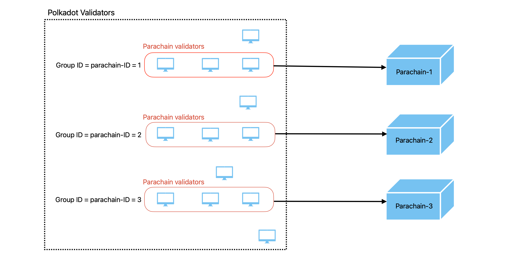
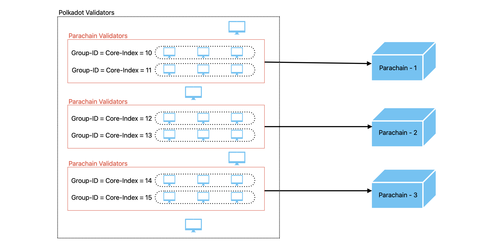

# Candidate backing subsystem design update
> Update Candidate backing subsystem to support Async backing + Elastic scaling

## Overview of Changes
### Remove use of ProspectiveParachainsMode
We currently have both legacy backing code and async backing code. Now that the async backing parameters runtime API is live on all networks, the backing subsystem code can be simplified. We can remove the use of `ProspectiveParachainsMode` and keep only the parts under `ProspectiveParachainsMode` enabled.

### Remove perLeaf field of CandidateBacking struct
- Remove the perLeaf field of the `CandidateBacking` struct as it keeps track of which active leaf has `ProspectiveParachainMode` enabled.
- if we need active leaf data, we can get it from backing implicit view which we store in `CandidateBacking`. (Yet to implement)

### Change GroupID from paraID to CoreIndex
Before elastic scaling, only a single group of validators was assigned to a parachain, so we assigned paraID to GroupID.


However, in elastic scaling, multiple groups of validators(core) will be assigned to a parachain. So now we have to change the type of GroupID from paraID to the `CoreIndex`, which is unique for assigned groups.



- Change the type of groupID from `paraID` to `CoreIndex` and check all the methods to see if any changes are needed.
    - Structs containing groupID: `Summary`, `tableContext`, `attestedCandidate`, `candidateData`.
- change `assignment *parachaintypes.ParaID` field to `assignedCore *parachaintypes.CoreIndex` in perRelayParentState which represents the core index assigned to the local validator at this relay parent.

### Update usage of [Prospective Parachains](./prospective-parachains.md) overseer message
Our async backing code uses `Fragment-tree`, which was introduced in Async backing and has now become `Fragment-chain`. So we need to update the code to use `Fragment-chain`.
- For sanity check if it is possible to second the candidate, in current code we are sending `ProspectiveParachainsMessageGetHypotheticalFrontier` overseer message to prospective parachain subsystem. we need to send `GetHypotheticalMembership` overseer message instead which will return the list of leaves where the candidate can be seconded.
- While importing a statement, if it's a new candidate (statement is 'seconded' and candidate is unknown), We need to inform the prospective parachains subsystem of the seconded candidate. currently we are sending two separate message `ProspectiveParachainsMessageIntroduceCandidate` to introduce new candidate and `ProspectiveParachainsMessageCandidateSeconded` to inform about seconded candidate we can combine both messages and send a single message `IntroduceSecondedCandidate`.

## overseer messages

### ActiveLeavesUpdate
Remove all usage of ProspectiveParachainMode, perLeaf field of `CandidateBacking` struct.

Add new fields into `perRelayParentState` and modify the `constructPerRelayParentState` function logic to fill the values of new fields. 

```
type perRelayParentState struct {
	...

	// claim queue stores the information of which parachain will be assigned to which core.
	claimQueue map[CoreIndex][]Assignment

	// injectCoreIndex is a flag to indicate if the core index should be injected 
	// in the BackedCandidate validator indices bitfield.
	// set true if ElasticScalingMVP is enabled
	injectCoreIndex bool

	// Add extra fields if needed during implementation.
}
```

runtime methods we will need
- claim queue: `ParachainHost_claim_queue`
- node features: `ParachainHost_node_features`

### GetBackableCandidates

The current struct to request backable candidates from the candidate backing subsystem doesn't provide info on which candidate belongs to which parachain. Now we have to update this overseer message structure `GetBackableCandidates` to provide a record of the parachain ID and candidates belonging to them and relay the parents of each candidate.
```
type GetBackableCandidates struct {
	Candidates map[parachaintypes.ParaID][]*CandidateHashAndRelayParent
	ResCh      chan map[parachaintypes.ParaID]*parachaintypes.BackedCandidate
}
```

`GetBackableCandidates` requests a set of backable candidates attested by the subsystem.

The order of candidates of the same parachain must be preserved in the response because candidates are supplied in dependency order. We must ensure that this dependency order is preserved.

If a backable candidate of a parachain cannot be retrieved, the response should not contain any candidates of the same parachain that follow it in the input slice. 
 
 For example:
 Candidates => [A, B, C, D, E, F, G, H]
 If we are unable to retrieve backable candidate D, the Response should be [A, B, C]
 
 ### CanSecond
Now we have prospective-parachain subsystem skeleton, So use overseer messages declared in that subsystem and remove the old/unneccesary types.

Remove all usage of ProspectiveParachainMode, perLeaf field of `CandidateBacking` struct.

Logic of this function written in the context of fragment tree, need to remove this code. after removing this code we just need to perform seconding sanity check to find if it is possible to second a candidate.

Update logic of seconding sanity check:
- now as we don't want to use prospective parachain mode anymore. instead of iterating over `perLeaf`, iterate over leaves in the implicit view.
- get hypothetical membership of the candidates from prospective parachain[res: candidate and it's hypothetical membership(list of leaves where the candidate could be added)]
- for each active leaf, check if they are present in the hypothetical membership. if present it's possible to second the candidate at that leaf.
- return the list of active leaves where candidate can be seconded.(return type changed)

If we don't find any leaf at which we can second the candidate, it is impossible to second the candidate

### Second
make sure local validator is not disabled before processing the candidate.

update ther logic to ensure the candidate is from our assignment
- using core index, validators can find parachains assigned to the core.(claim queue will provide this info)
- candidate's parachain id should be in the list of parachains we get from claim queue.

### Statement
Don't import statement if the sender is disabled.

in `kickOffValidationWork` method of `perRelayParentState`.
- Do nothing if the local validator is disabled or not a validator at all.

in `rpState.postImportStatement` method 
- remove the code under the branch of prospective parachain mode disabled.
- in the code under the branch of prospective parachain mode enabled remove the code to send `collatorprotocolmessages.Backed` overseer message.

## Validated Candidate command
modification in `signImportAndDistributeStatement` function
- Need to provide core index as argument to `table.importStatement` method to use core index instead of paraID inside the method.

No changes are needed in the logic to process `Attest` and `AttestNoPov` commands.

changes we need in the logic to process `Second` command
- there is some code seems to be not required. So remove this code where we compare
persistedValidationData.ParentHead.Data hash with commitments.HeadData.Data hash.
- remove the code to update seconded depths in active leaves, which is related to fragment tree.
