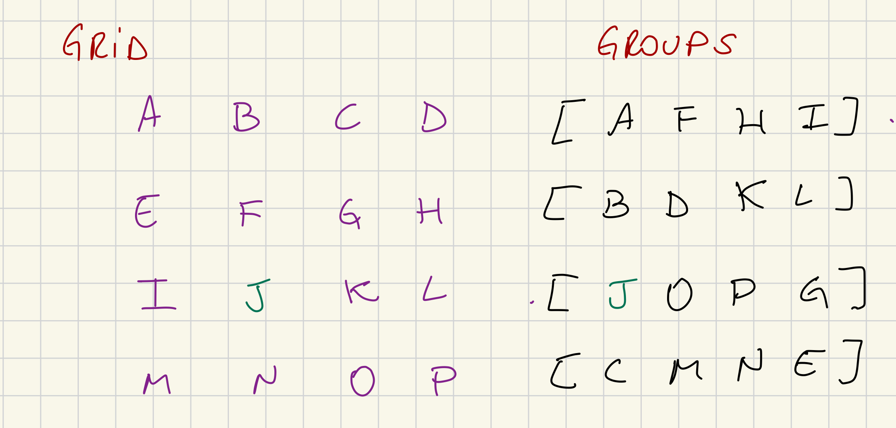

# Statement Distribution

This subsystem is responsible for distributing signed statements that we have generated and forwarding statements generated by our peers.

## Subsystem Structure

The subsystem needs to handle multiple channels, beyond the overseer channel we also need to manage request and responses channels that are generated by spawned goroutines. These goroutines are called "responders" and in the parity implementation there exists 2 "responders", *larger_statement_responder* (legacy) and *candidate_responder* (v2).

The responsibility of these "responders" is to listen for incoming requests and forward them to inside the statement distribution (as they are spawned goroutines), which will reach the target function that will respond to the request properly. The "responders" also act as a limiter on the amount of requests we are capable of handling.
 
For V2:
- Incoming request type [AttestedCandidateRequest](https://github.com/paritytech/polkadot-sdk/blob/3d8da815ecd12b8f04daf87d6ffba5ec4a181806/polkadot/node/network/protocol/src/request_response/v2.rs#L32)
- Response type [AttestedCandidateResponse](https://github.com/paritytech/polkadot-sdk/blob/3d8da815ecd12b8f04daf87d6ffba5ec4a181806/polkadot/node/network/protocol/src/request_response/v2.rs#L47)
- The handler [answer_request](https://github.com/paritytech/polkadot-sdk/blob/c0921339f9d486981b3681760ee83ba9237f2eaa/polkadot/node/network/statement-distribution/src/v2/mod.rs#L3245)

For V1 (No need for handling such requests or implementing the handlers, will be removed soon see https://github.com/paritytech/polkadot-sdk/issues/4447):
- Incoming request type [StatementFetchingRequest](https://github.com/paritytech/polkadot-sdk/blob/c0921339f9d486981b3681760ee83ba9237f2eaa/polkadot/node/network/protocol/src/request_response/v1.rs#L196)
- The handler [handle_responder_message](https://github.com/paritytech/polkadot-sdk/blob/c0921339f9d486981b3681760ee83ba9237f2eaa/polkadot/node/network/statement-distribution/src/legacy_v1/mod.rs#L1896)

The V2 brings a new advantage, the validators don't send each other heavy `CommitedCandidateReceipt`, but instead request them lazily through request/response protocols.

The messages that validators can exchange are: 
- `Statement`: contains only a signed compact statement;
- `BackedCandidateManifest`: advertise a description of a backed candidate and stored statements;
- `BackedCandidateAcknowledgement`: acknowledges that a backed candidate is fully known.

### Messages Received

The subsystem must be registered with the overseer and handle subsystem-specific messages from it:

1. [StatementDistributionMessage::Share](https://github.com/paritytech/polkadot-sdk/blob/c0921339f9d486981b3681760ee83ba9237f2eaa/polkadot/node/subsystem-types/src/messages.rs#L829)

- We have originated a signed statement in the context of given relay-parent hash and it should be distributed to other validators

2. [StatementDistributionMessage::Backed](https://github.com/paritytech/polkadot-sdk/blob/c0921339f9d486981b3681760ee83ba9237f2eaa/polkadot/node/subsystem-types/src/messages.rs#L836)

- The candidate received enough validity votes from the backing group. If the candidate is backed as a result of a local statement, this message MUST be preceded by a `Share` message for that statement. This ensures that Statement Distribution is always aware of full candidates prior to receiving the `Backed` notification, even when the group size is 1 and the candidate is seconded locally

3. [StatementDistributionMessage::NetworkBridgeUpdate](https://github.com/paritytech/polkadot-sdk/blob/c0921339f9d486981b3681760ee83ba9237f2eaa/polkadot/node/subsystem-types/src/messages.rs#L839)

- Event from the network bridge.

4. [OverseerSignal::ActiveLeaves](https://github.com/paritytech/polkadot-sdk/blob/c0921339f9d486981b3681760ee83ba9237f2eaa/polkadot/node/subsystem-types/src/lib.rs#L114)

### Messages Sent

1. [NetworkBridgeTxMessage::SendValidationMessages](https://github.com/paritytech/polkadot-sdk/blob/3d8da815ecd12b8f04daf87d6ffba5ec4a181806/polkadot/node/subsystem-types/src/messages.rs#L424)

- Send a batch of validation messages and they will be send in order

2. [NetworkBridgeTxMessage::SendValidationMessage](https://github.com/paritytech/polkadot-sdk/blob/3d8da815ecd12b8f04daf87d6ffba5ec4a181806/polkadot/node/subsystem-types/src/messages.rs#L416C2-L416C23)

- Send a message to one or more peers on the validation peer-set.

3. [NetworkBridgeTxMessage::ReportPeer](https://github.com/paritytech/polkadot-sdk/blob/3d8da815ecd12b8f04daf87d6ffba5ec4a181806/polkadot/node/subsystem-types/src/messages.rs#L410)

4. [CandidateBackingMessage::Statement](https://github.com/paritytech/polkadot-sdk/blob/3d8da815ecd12b8f04daf87d6ffba5ec4a181806/polkadot/node/subsystem-types/src/messages.rs#L112)

- Note a validator's statement about a particular candidate in the context of the given relay-parent. Disagreements about validity must be escalated to a broader check by the Disputes Subsystem, though that escalation is deferred until the approval voting stage to guarantee availability. Agreements are simply tallied until a quorum is reached.

5. [ProspectiveParachainsMessage::GetHypotheticalMembership](https://github.com/paritytech/polkadot-sdk/blob/3d8da815ecd12b8f04daf87d6ffba5ec4a181806/polkadot/node/subsystem-types/src/messages.rs#L1411)

- Get the hypothetical or actual membership of candidates with the given properties under the specified active leaf associated fragment chain. For each candidate, we return a vector of leaves where the candidate is present or could be added. "Could be added" either means that the candidate can be added to the chain right now or could be added in the future (we may not have its ancestors yet). Note that even if we think it could be added in the future, we may find out that it was invalid, as time passes. If an active leaf is not in the vector, it means that there's no chance this candidate will become valid under that leaf in the future. If `fragment_chain_relay_parent` in the request is `Some()`, the return vector can only contain this relay parent (or none).

6. [NetworkBridgeTxMessage::SendRequests](https://github.com/paritytech/polkadot-sdk/blob/3d8da815ecd12b8f04daf87d6ffba5ec4a181806/polkadot/node/subsystem-types/src/messages.rs#L433)

- Sends request via normal network layer

## Subsystem State

The Statement Distribution subsystem currently has 2 states to manage under the current implementation but here we should focus on `v2::State` given that `v1::State` is legacy code and will be removed soon see https://github.com/paritytech/polkadot-sdk/issues/4447.

The state holds
- the implicit view
- candidates (a tracker for all known candidates in the view)
- per-relay-parent state
- per-session state
- unused topologies (topologies might be received before the first leaf update, so we should cache it)
- peers view and state
- keystore
- authorities (a map from authority id to peer id)
- request and response manager

## Message Handling Logic

1. [handle_subsystem_message](https://github.com/paritytech/polkadot-sdk/blob/3d8da815ecd12b8f04daf87d6ffba5ec4a181806/polkadot/node/network/statement-distribution/src/lib.rs#L308): This handler deals with multiple kinds of messages from the overseer (also other subsystems):

- **OverseerSignal::ActiveLeaves**: we should implement the [`v2::handle_active_leaves_update`](https://github.com/paritytech/polkadot-sdk/blob/3d8da815ecd12b8f04daf87d6ffba5ec4a181806/polkadot/node/network/statement-distribution/src/v2/mod.rs#L578) and also [v2::handle_deactivate_leaves](https://github.com/paritytech/polkadot-sdk/blob/3d8da815ecd12b8f04daf87d6ffba5ec4a181806/polkadot/node/network/statement-distribution/src/v2/mod.rs#L798)

- **StatementDistributionMessage::Share**: this message is handled by [`v2::share_local_statement`](https://github.com/paritytech/polkadot-sdk/blob/3d8da815ecd12b8f04daf87d6ffba5ec4a181806/polkadot/node/network/statement-distribution/src/v2/mod.rs#L1181), where a local originated statement is imported and need to be distributed to peers, calls [`v2::circulate_statement`](https://github.com/paritytech/polkadot-sdk/blob/3d8da815ecd12b8f04daf87d6ffba5ec4a181806/polkadot/node/network/statement-distribution/src/v2/mod.rs#L1343-L1344)

- **StatementDistributionMessage::NetworkBridgeUpdate**: messages coming from network bridge might be labeled with its version. We should focus only on messages labeled `Version::V2` and `Version::V3`. Messages targeting the current protocol they are handled by [`v2::handle_network_update`](https://github.com/paritytech/polkadot-sdk/blob/3d8da815ecd12b8f04daf87d6ffba5ec4a181806/polkadot/node/network/statement-distribution/src/v2/mod.rs#L428). The message from the network bridge can unwrap in one of the following messages:
- `NetworkBridgeEvent::PeerConnected`: update the current subsystem state peer view
- `NetworkBridgeEvent::PeerDisconnected`: update the current subsystem state peer view
- `NetworkBridgeEvent::NewGossipTopology`: given the incoming topology checks if we already have such session index to supply the topology, otherwise keep it in the `unused_topology`
- `NetworkBridgeEvent::PeerViewChange`: handled by [`handle_peer_view_update`](https://github.com/paritytech/polkadot-sdk/blob/3d8da815ecd12b8f04daf87d6ffba5ec4a181806/polkadot/node/network/statement-distribution/src/v2/mod.rs#L838-L839)
- `NetworkBridgeEvent::OurViewChange`: do nothing
- `NetworkBridgeEvent::UpdatedAuthorityIds`: we could find the PeerIDs of current session authorities, update them in the subsystem state.
- `NetworkBridgeEvent::PeerMessage`:
    - `StatementDistributionMessage::V1(_)`: ignore the message
    - `StatementDistributionMessage::V2(protocol_v2::StatementDistributionMessage::V1Compatibility)`: ignore the message
    - `StatementDistributionMessage::V3(protocol_v3::StatementDistributionMessage::V1Compatibility)`: ignore the message
    - `StatementDistributionMessage::V2(protocol_v2::StatementDistributionMessage::Statement)`: handled by [`handle_incoming_statement`](https://github.com/paritytech/polkadot-sdk/blob/3d8da815ecd12b8f04daf87d6ffba5ec4a181806/polkadot/node/network/statement-distribution/src/v2/mod.rs#L1549-L1550)
    - `StatementDistributionMessage::V3(protocol_v3::StatementDistributionMessage::Statement)`: handled by [`handle_incoming_statement`](https://github.com/paritytech/polkadot-sdk/blob/3d8da815ecd12b8f04daf87d6ffba5ec4a181806/polkadot/node/network/statement-distribution/src/v2/mod.rs#L1549-L1550)
    - `StatementDistributionMessage::V2(protocol_v2::StatementDistributionMessage::BackedCandidateManifest)`: handled by [`handle_incoming_manifest`](https://github.com/paritytech/polkadot-sdk/blob/3d8da815ecd12b8f04daf87d6ffba5ec4a181806/polkadot/node/network/statement-distribution/src/v2/mod.rs#L2339-L2340)
    - `StatementDistributionMessage::V3(protocol_v3::StatementDistributionMessage::BackedCandidateManifest)`: handled by [`handle_incoming_manifest`](https://github.com/paritytech/polkadot-sdk/blob/3d8da815ecd12b8f04daf87d6ffba5ec4a181806/polkadot/node/network/statement-distribution/src/v2/mod.rs#L2339-L2340)
    - `StatementDistributionMessage::V2(protocol_v2::StatementDistributionMessage::BackedCandidateKnown)`: handled by [`handle_incoming_acknowledgement`](https://github.com/paritytech/polkadot-sdk/blob/3d8da815ecd12b8f04daf87d6ffba5ec4a181806/polkadot/node/network/statement-distribution/src/v2/mod.rs#L2726-L2727)
    - `StatementDistributionMessage::V3(protocol_v3::StatementDistributionMessage::BackedCandidateKnown)`: handled by [`handle_incoming_acknowledgement`](https://github.com/paritytech/polkadot-sdk/blob/3d8da815ecd12b8f04daf87d6ffba5ec4a181806/polkadot/node/network/statement-distribution/src/v2/mod.rs#L2726-L2727)

- **StatementDistributionMessage::Backed**: handles the notification of a candidate being backed. The candidate should be known before to be handled correctly if the candidate is not known the message is dropped. This calls [`provide_candidate_to_grid`](https://github.com/paritytech/polkadot-sdk/blob/76a292b23bf6f35156fd3dd832e9c4ec31b24b2c/polkadot/node/network/statement-distribution/src/v2/mod.rs#L1983C10-L1983C35) which provides the a backable candidate to the grid and dispatchs backable candidates announcements and acknowledgments via grid topology, if the session topology is not yet available then it will be a noop. Next method used is [`prospective_backed_notification_fragment_chain_updates`](https://github.com/paritytech/polkadot-sdk/blob/76a292b23bf6f35156fd3dd832e9c4ec31b24b2c/polkadot/node/network/statement-distribution/src/v2/mod.rs#L2309) which retrieve hypothetical membership from Prospective-Parachains and send them to Candidate-Backing subsystem as fresh statements through the function [`send_backing_fresh_statements`](https://github.com/paritytech/polkadot-sdk/blob/41a5d8ec5f3d3d0ff82899be66113b223395ade5/polkadot/node/network/statement-distribution/src/v2/mod.rs#L1929).

2. [handle_response](https://github.com/paritytech/polkadot-sdk/blob/b8da8faa0a675afbed1c9ed5d524a674e93910b9/polkadot/node/network/statement-distribution/src/lib.rs#L287) 

- After `ResponseManager` receives a message from the peer we're requesting some data this handler is triggered to handle the incoming response. 

3. [answer_request](https://github.com/paritytech/polkadot-sdk/blob/41a5d8ec5f3d3d0ff82899be66113b223395ade5/polkadot/node/network/statement-distribution/src/v2/mod.rs#L3245-L3246)

- Given a [`AttestedCandidateRequest`](https://github.com/paritytech/polkadot-sdk/blob/82117ad53fc68e8097183e759926b62265ffff0a/polkadot/node/network/protocol/src/request_response/v2.rs#L32) request we should respond the request for the asked candidate hash.

4. [dispatch_requests](https://github.com/paritytech/polkadot-sdk/blob/b8da8faa0a675afbed1c9ed5d524a674e93910b9/polkadot/node/network/statement-distribution/src/lib.rs#L303C8-L303C25)

- This method is called in 2 situations: right after one of the above handles finishes execution, that is why while handling a message we might have produced a request to dispatch for example: we received a `Manifest` message and now we need to request the candidate so we build the candidate request and place them in the `RequestManager` queue and after handling the message we call `dispatch_requests`. The second situation is when we receive a `RetryRequest` message coming from `RequestManager`, meaning that we have failed requests in the queue to dispatch. 

## Grid Mode

Here is a brief explanation of the function [`build_session_topology`](https://github.com/paritytech/polkadot-sdk/blob/41a5d8ec5f3d3d0ff82899be66113b223395ade5/polkadot/node/network/statement-distribution/src/v2/grid.rs#L118-L119) that is an important part to define our sender/receivers in the grid mode topology

The method [`build_session_topology`](https://github.com/paritytech/polkadot-sdk/blob/41a5d8ec5f3d3d0ff82899be66113b223395ade5/polkadot/node/network/statement-distribution/src/v2/grid.rs#L118-L119) builds a view of the topology for the session. The network bridge gives us the entire grid topology for a certain session. In it, we know our neighbors in the X axis and Y axis (based on our validator index). So together with the [`Groups`](https://github.com/paritytech/polkadot-sdk/blob/5ca726750da563c46449f9aa915296e6c6967e61/polkadot/node/network/statement-distribution/src/v2/groups.rs#L28), which is the validator group within the session, we can define the peers we expect to receive messages and the peers we should send messages to.

1. We should not send `Manifests` or `Acknowledgements` to validators in the same group as ours. They are already present in the Cluster topology. We should send those messages to peers in the same "row" and "column" as ours if they are not part of our group.

2. if the validator is not in the same group, we should check if we share the same "row" or "column". If we share the same **ROW** then I expect to receive messages from him, and I will propagate his messages with my **COLUMN** neighbors that are not part of the sender's group. It's the same logic the other way around. If we share the same **COLUMN** then I expect to receive messages from him, and I will propagate his messages with my **ROW** neighbors that are not part of the sender's group.

Take the example:

1) Considering that **J** is our validator index, we share X axis with **[I, K, J]** and Y axis with **[B, F, N]**, lets say that a message coming from `B` arrives, we can only propagate the message to validator `I`, as `K` and `L` are from the same group as `B`.

2) Considering that we, `J`, want to share a `Manifest` with our grid neighbors, we can send the message to **[I, K, J]** and **[B, F, N]** as they are not part of the group I belong to.

## Request and Response Managers

Whenever we're [`handling an incoming statement`](https://github.com/paritytech/polkadot-sdk/blob/3d8da815ecd12b8f04daf87d6ffba5ec4a181806/polkadot/node/network/statement-distribution/src/v2/mod.rs#L1549-L1550) or [`handling an incoming manifest`](https://github.com/paritytech/polkadot-sdk/blob/3d8da815ecd12b8f04daf87d6ffba5ec4a181806/polkadot/node/network/statement-distribution/src/v2/mod.rs#L2339-L2340) we do check if we have the related candidate, if we don't know it we should request if from the peer and that is made through [`RequestManager`](https://github.com/paritytech/polkadot-sdk/blob/f4a196ab1473856c9c5992239fcc2f14c2c42914/polkadot/node/network/statement-distribution/src/v2/requests.rs#L162) and [`ResponseManager`](https://github.com/paritytech/polkadot-sdk/blob/f4a196ab1473856c9c5992239fcc2f14c2c42914/polkadot/node/network/statement-distribution/src/v2/requests.rs#L429).

The outgoing requests are managed by the request manager, and it is responsible also for holding requests that failed and marking them to retry later. After the Statement Distribution finishes to handling some message it calls [`v2::dispatch_requests`](https://github.com/paritytech/polkadot-sdk/blob/f4a196ab1473856c9c5992239fcc2f14c2c42914/polkadot/node/network/statement-distribution/src/lib.rs#L303) which will drain the requests in the [`RequestManager`](https://github.com/paritytech/polkadot-sdk/blob/f4a196ab1473856c9c5992239fcc2f14c2c42914/polkadot/node/network/statement-distribution/src/v2/requests.rs#L162) manager queue and will now track the in-flight requests in the [`ResponseManager`](https://github.com/paritytech/polkadot-sdk/blob/f4a196ab1473856c9c5992239fcc2f14c2c42914/polkadot/node/network/statement-distribution/src/v2/requests.rs#L429), that is made through a communication channel, the request will be sent to `NetworkBridgeSubsystem` and the `ResponseManager` will wait until any info comes through communication channel pipe ([`receive_response`](https://github.com/paritytech/polkadot-sdk/blob/f4a196ab1473856c9c5992239fcc2f14c2c42914/polkadot/node/network/statement-distribution/src/v2/mod.rs#L3067)), when that happens the message will be handled by Statement Distribution Subsystem under [`handle_response`](https://github.com/paritytech/polkadot-sdk/blob/f4a196ab1473856c9c5992239fcc2f14c2c42914/polkadot/node/network/statement-distribution/src/v2/mod.rs#L3088).
